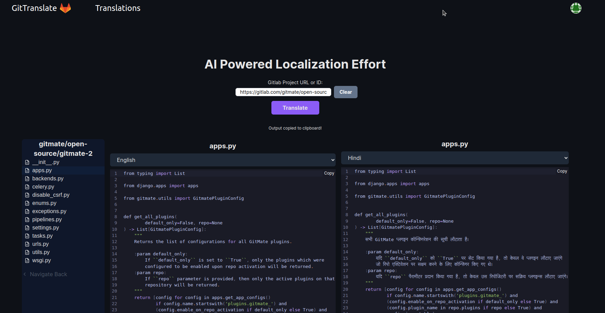

# Git Localizer

Use AI to translate code comments, filenames from one language to another.




## Running Locally

**1. Clone Repo**

```bash
git clone https://gitlab.com/collinsLubwama/gitlocalizer
```

**2. Install Dependencies**

```bash
npm i
```

**3. Run App**

```bash
npm run dev
```

## Contact

If you have any questions, feel free to reach out to me on [Twitter](https://twitter.com/thesupremesage).
